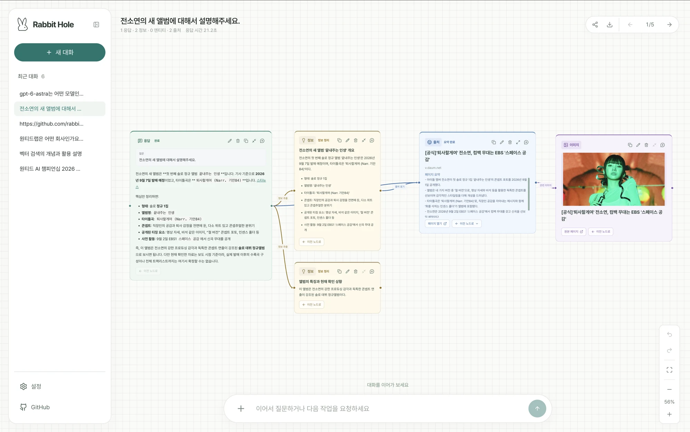
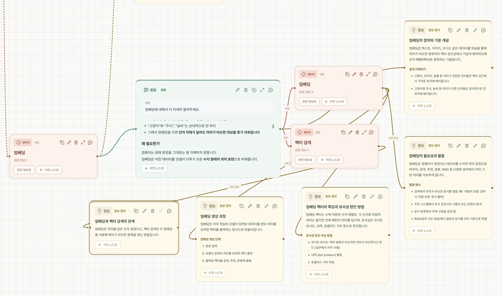
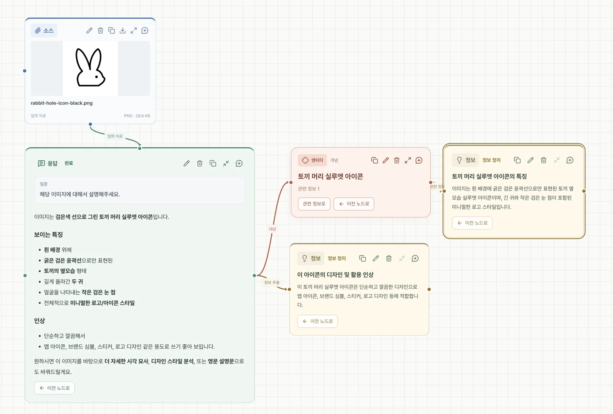
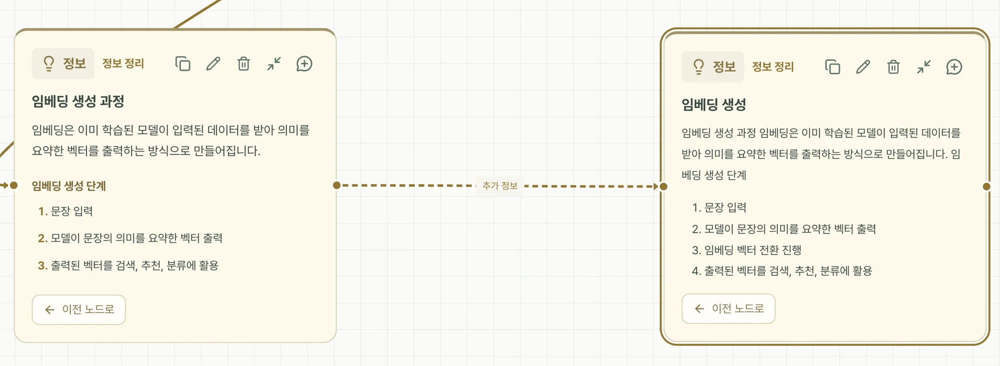
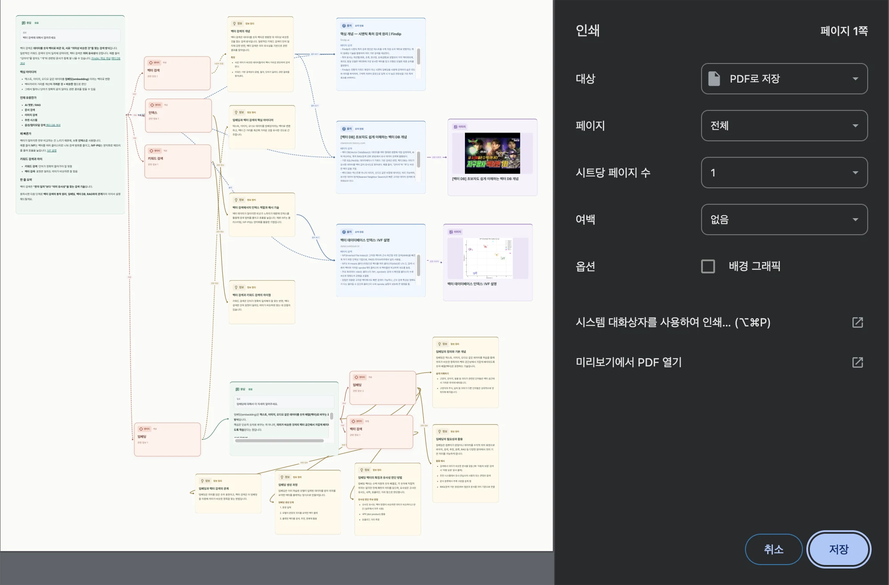
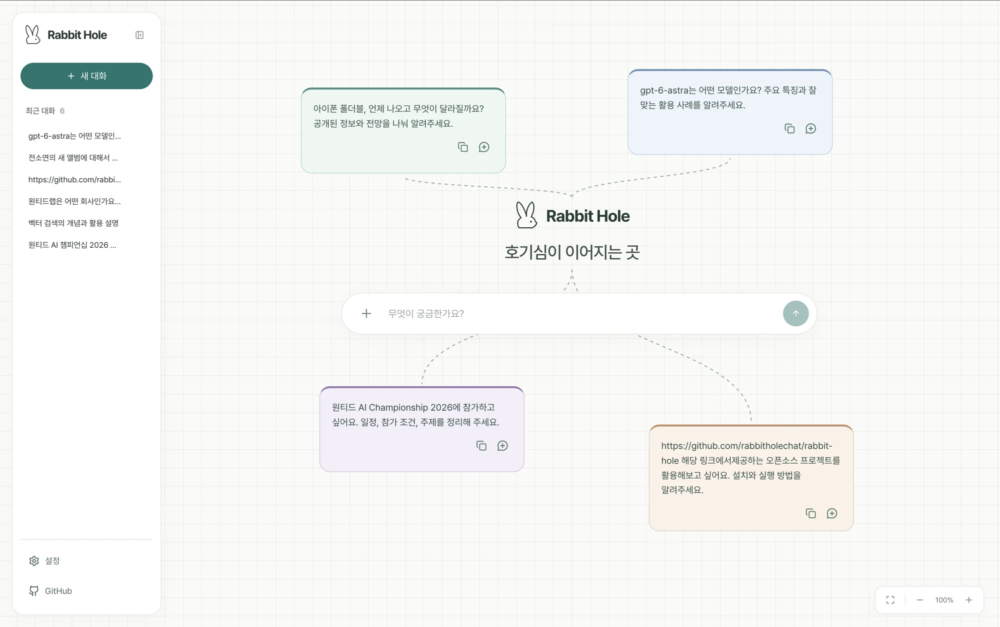

# Rabbit Hole

### 하나의 질문에서, 다음 호기심으로.

Rabbit Hole은 **질문과 답변을 하나의 캔버스에서 탐색하는 AI 서비스**입니다. 답변을 읽고, 핵심 정보와 출처를 살펴보고, 더 궁금한 지점에서 다음 질문을 이어 가세요. 대화가 쌓일수록 나만의 탐색 지도가 만들어집니다.

[주요 기능](#주요-기능) · [사용 흐름](#사용-흐름) · [개발 가이드](docs/DEVELOPMENT.md)

## 주요 기능

### 답변과 핵심 정보를 함께 살펴보세요

질문을 보내면 답변이 카드에 실시간으로 나타납니다. 완료된 답변은 내용에 맞는 정보 카드와 주요 대상·개념으로 정리됩니다. 원래 답변으로 돌아가 문맥을 읽거나, 출처 카드에서 실제 조회한 페이지를 열어 볼 수 있습니다.

캔버스를 이동하고 확대·축소하면서 전체 흐름과 세부 내용을 오가세요. 필요한 카드만 펼쳐 집중해서 읽을 수도 있습니다.

### 궁금한 지점에서 대화를 이어 가세요

응답에서 **이어서 질문하기**를 누르거나, 정보·개념 카드를 다음 응답에 사용해 더 깊이 알아보세요. 앞서 살펴본 내용과 새로운 답변을 같은 화면에서 비교할 수 있습니다.

### 이미지와 파일도 질문의 출발점이 됩니다

입력창의 **+** 버튼에서 이미지나 파일을 첨부하세요. 궁금한 이미지의 특징을 묻거나 문서 내용을 바탕으로 대화를 시작할 수 있습니다. 웹 검색과 URL 접근도 질문에 맞춰 선택할 수 있습니다.

### 찾은 내용을 내 방식으로 정리하세요

필요한 카드를 복사해 붙여 넣고, 제목과 내용을 수정하세요. 카드를 원하는 위치로 옮기거나 직접 연결선을 만들고 이름을 붙여 탐색 내용을 정리할 수 있습니다. 실행 취소와 다시 실행도 지원합니다.

### 탐색한 캔버스를 공유하고 보관하세요

**공유** 버튼으로 현재 캔버스를 담은 읽기 전용 링크를 만들 수 있습니다. 받는 사람은 카드를 살펴보고 내용을 복사할 수 있습니다. HTML로 내려받거나 인쇄 화면에서 PDF로 저장해 탐색 결과를 보관하세요.

## 사용 흐름

1. **질문하기** — 떠오른 질문을 입력하거나 시작 화면의 예시 질문을 골라 보세요.
2. **살펴보기** — 답변, 핵심 정보, 주요 개념과 출처를 캔버스에서 읽어 보세요.
3. **이어가기** — 더 궁금한 카드를 선택해 다음 질문을 이어 가세요.
4. **정리하고 공유하기** — 카드를 배치·편집하고 링크나 파일로 남기세요.

## 대화 기록과 현재 데모

왼쪽 사이드바에서 대화별 기록을 열 수 있습니다. 다른 대화로 이동해도 진행 중인 응답과 카드 정리는 이어지며, 해당 대화에는 스피너와 **생성 중** 표시가 나타납니다. 저장된 대화를 다시 열면 카드 위치와 화면 위치도 복원됩니다.

현재 데모는 **모든 방문자가 같은 대화 기록을 조회·수정·삭제하는 공용 공간**입니다. 개인 계정별 기록 분리는 제공하지 않습니다. 탭을 닫거나 새로고침하면 진행 중인 생성은 중단되고, 다시 방문하면 저장된 내용까지 열람할 수 있습니다.

출처를 조회한 것과 답변에 출처를 표기한 것은 구분해 표시합니다. 대화 순서, 정보 연결, 직접 만든 연결선도 의미가 다르며, 연결 자체가 사실 검증을 뜻하지는 않습니다.

## 프로젝트 문서

| 문서 | 내용 |
| --- | --- |
| [개발 가이드](docs/DEVELOPMENT.md) | 로컬 실행, 코드 구조, 모델·도구 설정, 저장과 요청 수명 |
| [실행·배포](docs/DEPLOYMENT.md) | PostgreSQL, Vercel, Docker 구성 |
| [API 계약](docs/API.md) | 스트리밍, 캔버스, 기록·공유 데이터 계약 |
| [첨부 자료](docs/ATTACHMENTS.md) | 지원 형식과 첨부 처리 |
| [디버깅](docs/DEBUGGING.md) | 로그, 중단점, 오류 진단 |
| [검증 기록](docs/VALIDATION.md) | 테스트 범위와 검증 결과 |
| [브랜드 자료](docs/BRAND.md) | 검정·흰색 PNG/SVG 아이콘 다운로드 |
