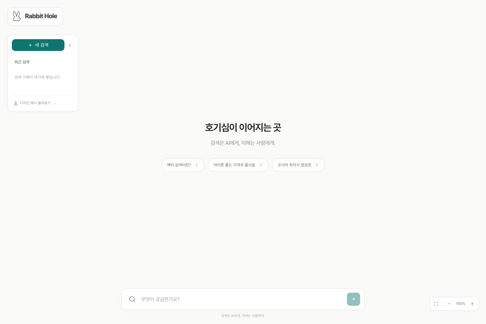
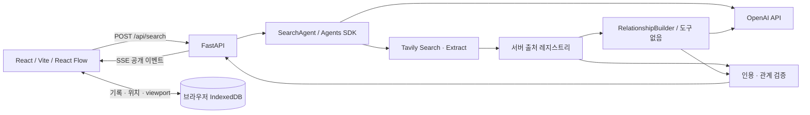

# Rabbit Hole

**검색은 AI에게, 이해는 사람에게.**

개별 웹페이지를 카드로 펼치고 내용 관계로 연결하는 검색 캔버스입니다. 검색 전후 동일한 React Flow 캔버스를 유지하며, AI 답변은 우측의 작은 보조 패널로 표시합니다.



## 빠른 시작

필요 도구: Node.js 20.19 이상(권장 22), Corepack, uv, Python 3.13 이상. `pnpm` 전역 설치 없이 `corepack pnpm`을 사용합니다.

```sh
make install
cp src/backend/.env.example src/backend/.env  # .env가 없을 때만 실행
# src/backend/.env에서 OPENAI_API_KEY, TAVILY_API_KEY 설정
make dev
```

이 작업 공간에는 비밀키가 비어 있는 `.env`와 로컬 서명키를 생성해 두었습니다. 기존 `.env`를 덮어쓰지 마세요. API 키 없이도 화면과 **디자인 예시 둘러보기**를 사용할 수 있습니다. 실제 검색 실패를 샘플로 대체하지 않습니다.

- 화면: http://127.0.0.1:5178
- API 상태: http://127.0.0.1:8018/api/health
- OpenAPI: http://127.0.0.1:8018/docs
- 종료: `Ctrl-C` — 실행한 두 서버의 프로세스 그룹 종료

| 명령                                                                | 동작                               |
| ------------------------------------------------------------------- | ---------------------------------- |
| `make frontend` / `make backend`                                    | 서버 개별 실행                     |
| `make dev`                                                          | 두 서버 함께 실행                  |
| `make check`                                                        | 타입 검사, Ruff, 단위 테스트, 빌드 |
| `make e2e`                                                          | 데스크톱·모바일 Playwright 테스트  |
| `corepack pnpm --dir src/frontend exec playwright install chromium` | E2E용 브라우저 설치                |
| `make docker`                                                       | 백엔드 Docker 이미지 빌드          |

모든 런타임 설정은 `src/backend/.env`에 모읍니다. Vite 개발 프록시도 여기의 포트를 읽습니다. 브라우저에 환경변수나 API 키를 주입하지 않으며, 배포에서는 같은 origin의 `/api`로 호출합니다.

## 구현 범위

- React Flow 전체 화면 캔버스, 가로 군집 d3-force 배치와 사각형 충돌 방지
- 동일 도메인의 다른 페이지 보존, 정규 URL 기반 안정 ID, 추적 파라미터 제거와 중복 재사용
- 페이지 카드·원문·발췌·문서 유형·인용 선택·관계 근거 상세
- SearchAgent + Tavily Search/Extract 함수 도구, 도구 없는 RelationshipBuilder
- 검색/원문/모델 턴/출력 토큰/시간/재시도 예산, SSE 진행 상태와 점진적 카드
- 출처·노드·발췌 검증, 답변 핵심 주장에 대한 별도 의미 검증
- 부분 성공, 실패 부문만 재시도, 작업 중지 및 이전 화면 이벤트 무시
- 관련 자료 추가 검색 시 기존 ID·드래그 위치·viewport 보존
- IndexedDB 기록 저장·복원·삭제, 복원 시 API 자동 재호출 없음
- 항공권 조건 확인, 실제 운임 공급자 미연결 명시, 가상 가격 미사용
- 접이식 모바일 패널, 키보드 노드 선택, 한국어 IME Enter 처리
- 검색과 분리된 벡터·폴드·항공권 디자인 예시

보조 개념 노드는 필수가 아니므로 초기 버전은 **웹페이지 카드만** 제공합니다. 로그인·서버 데이터베이스·WebSocket·예약 기능은 포함하지 않습니다.

## 아키텍처



| 경로                                  | 책임                                                             |
| ------------------------------------- | ---------------------------------------------------------------- |
| `src/frontend/src/components`         | 재사용 토끼 아이콘, shadcn/ui Button, 페이지·관계·답변·조건 입력 |
| `src/frontend/src/store.ts`           | 세션·작업 상태, SSE 세대 격리, 검색·재시도·기록                  |
| `src/frontend/src/lib`                | 레이아웃, IndexedDB, SSE 파서, 분리된 디자인 예시                |
| `src/backend/rabbit_hole/app.py`      | API/SSE, 작업 격리·제한, 부분 성공·체크포인트                    |
| `src/backend/rabbit_hole/search.py`   | SDK 에이전트, Tavily 도구, 강제 예산, 의미 검증                  |
| `src/backend/rabbit_hole/sources.py`  | URL·출처 레지스트리·인용·관계 검증                               |
| `src/backend/rabbit_hole/security.py` | 서버 확보 출처의 서명 스냅샷                                     |
| `api/index.py` / `vercel.json`        | Vercel Python Function / 정적 화면                               |

상세 계약은 [docs/API.md](docs/API.md), 배포는 [docs/DEPLOYMENT.md](docs/DEPLOYMENT.md), 검증 및 제한은 [docs/VALIDATION.md](docs/VALIDATION.md)를 참조하세요.

## 환경변수

정확한 기본값과 주석은 [src/backend/.env.example](src/backend/.env.example)에 있습니다.

| 변수                                            | 기본값 / 의미                                               |
| ----------------------------------------------- | ----------------------------------------------------------- |
| `OPENAI_API_KEY`, `TAVILY_API_KEY`              | 서버 전용 API 키. 미설정 시 실제 검색 503                   |
| `OPENAI_MODEL`                                  | `gpt-4.1-mini`; 도구 호출·구조화 출력 지원 모델로 변경 가능 |
| `MAX_SEARCH_CALLS`                              | 작업당 3회, 실제 재시도도 차감                              |
| `MAX_SOURCES`                                   | 작업당 새 페이지 최대 10개                                  |
| `MAX_SESSION_SOURCES`                           | 누적 탐색 40개, 이후 새 검색 필요                           |
| `MAX_EXTRACT_SOURCES`                           | 작업당 원문 최대 5개, 재시도 포함                           |
| `JOB_TIMEOUT_SECONDS`                           | 전체 작업 90초                                              |
| `REQUEST_TIMEOUT_SECONDS`                       | 외부 요청 20초                                              |
| `EXTERNAL_RETRIES`                              | 외부 요청 재시도 최대 1회                                   |
| `MAX_MODEL_TURNS`                               | SDK 실행당 8턴                                              |
| `MAX_OUTPUT_TOKENS`                             | 모델 응답당 4,000토큰                                       |
| `MAX_REQUEST_BYTES`                             | JSON 본문 2,100,000바이트 상한                              |
| `MAX_CONCURRENT_JOBS`                           | 프로세스당 동시 작업 4개                                    |
| `REQUESTS_PER_MINUTE`                           | 직접 연결 클라이언트 IP당 분당 10개                         |
| `JOB_TTL_SECONDS`, `MAX_STORED_JOBS`            | 작업 제어 정보 1,800초 / 100개                              |
| `SESSION_SIGNING_KEY`                           | 배포 필수, 32자 이상 무작위 비밀값. 모든 인스턴스에 동일 값 |
| `BACKEND_HOST`, `BACKEND_PORT`, `FRONTEND_PORT` | `127.0.0.1`, `8018`, `5178`                                 |

SDK tracing은 코드에서 비활성화합니다. 모델 응답 저장도 `store=False`입니다. 검색어·원문은 기능 수행에 필요한 OpenAI/Tavily 요청으로 전송됩니다. 추적 기능이 꺼져 있어도 두 공급자의 데이터 정책은 각각 적용됩니다.

## Git 규칙

`main`은 검증된 통합 브랜치입니다. 작업은 `feat/<kebab-case>`, `fix/<kebab-case>`, `docs/<kebab-case>`, `test/<kebab-case>`에서 진행하고 검증 후 fast-forward로 통합합니다. 커밋 형식과 제품 불변 조건은 [AGENTS.md](AGENTS.md)에 있습니다. 원격 저장소 연결·push·실제 배포는 수행하지 않았습니다.
